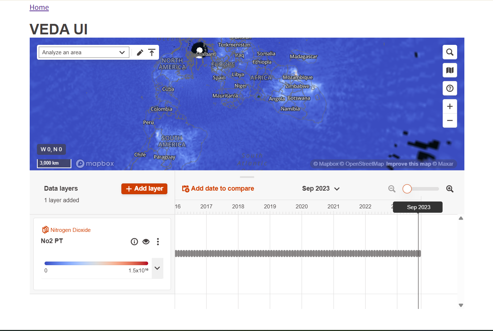
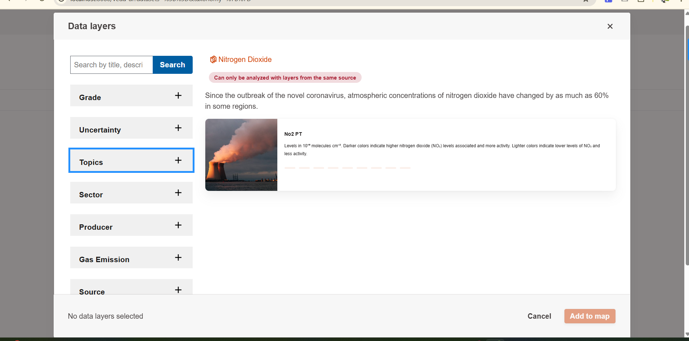

Drupal Veda UI Module Example
=============================

This is an example Drupal module demonstrating how to render a React component inside a Drupal site. This specific example renders Veda's `<ExplorationAndAnalysis/>` component, configured to display a hard-coded dataset via its STAC endpoint parameter (though the surrounding API endpoints are configurable).

To get this up and running in Drupal:
-------------------------------------

1.  **Copy Module:** Copy the entire `veda_ui` folder from this repository into your Drupal installation's `modules/custom/` directory.
2.  **Install Module:** Enable the "Veda UI" module via the Drupal administration interface (`/admin/modules`) or using Drush (`drush en veda_ui -y`).
3.  **Configure Settings:** Navigate to the module's settings page at `/admin/config/veda-ui/settings` in your Drupal admin area. Enter your Mapbox Access Token, your STAC API endpoint, and your Raster API endpoint. Save the configuration.
4.  **Build Frontend Assets:** Navigate to the module directory (`modules/custom/veda_ui`) in your terminal and run:


    ```
    yarn install
    yarn run build

    ```

5.  **Clear Cache:** Clear Drupal's cache via the UI (`/admin/config/development/performance`) or Drush (`drush cr`).
6.  **Visit Page:** Navigate to `/veda-ui` on your Drupal site to view the rendered Veda Exploration and Analysis Interface.

**Note:: The components styling will not match perfectly with Veda. Using USWDS base theme for Drupal and disabling JS and CSS aggregation in Drupal's configuration page will make it presentable. The screenshots below are taken after these steps were taken.**

About This Module: How it Works Fundamentally
---------------------------------------------

This module integrates a React application with Drupal using a common pattern:

1.  **Drupal Controller:** When you visit `/veda-ui`, a Drupal controller (`VedaUiController.php`) renders a basic HTML page containing an empty `<div>` (specifically `<div id="root"></div>`).
2.  **Asset Loading:** The controller also tells Drupal to load the compiled JavaScript and CSS assets associated with this module (defined in `veda_ui.libraries.yml`). These assets contain the bundled React application code.
3.  **React Mounting:** The loaded JavaScript code (from the React app's entry point, `js/index.jsx`) finds the `<div id="root"></div>` on the page and uses React's rendering mechanism (`ReactDOM.createRoot().render()`) to mount the `<ExplorationAndAnalysis/>` component inside that specific div.
4.  **Configuration:** Settings entered in the Drupal admin form are passed from the controller to the JavaScript via `drupalSettings`, making them available to the React component upon loading.

**Note:: The data used for this interface are being pulled from veda_ui/js/datasets.ts file**

Building Blocks Explained
-------------------------

### `veda_ui.info.yml`

-    A required Drupal file that defines metadata about the module.
-    It tells Drupal that this directory contains a module, gives it a human-readable name ("Veda UI"), specifies its description, declares compatibility with Drupal core versions (`^9 || ^10`), and lists any module dependencies (like the `config` module for handling settings). Drupal uses this file to list the module on the `/admin/modules` page and manage its installation.

### `veda_ui.libraries.yml`

-  A Drupal file used to define "libraries" of CSS and JavaScript assets.
-  It registers the compiled output of the React application as a library named `veda_ui`. It specifies the paths to these files. The controller then uses the library name (`veda_ui/veda_ui`) to tell Drupal to load these bundled JS and CSS files when rendering the `/veda-ui` page.

### `webpack.config.js`

A configuration file for Webpack, a popular JavaScript module bundler. It is not directly used by Drupal but is essential for developing the React part of the module.

### `src/Controller/VedaUiController.php`

-   A PHP class defining a Drupal Controller. Controllers handle requests for specific routes.
-   This controller is linked to the `/veda-ui` path (defined in `veda_ui.routing.yml`). When a user visits `/veda-ui`, the `vedaUi()` method within this controller is executed. Its main job is to return a Drupal render array that:
    1.  Includes the essential HTML markup `<div id="root"></div>`, which acts as the placeholder for the React application.
    2.  Attaches the `veda_ui/veda_ui` library (defined in `veda_ui.libraries.yml`), causing the browser to load the compiled JS and CSS.
    3.  Loads configuration settings (Mapbox token, API endpoints) from Drupal's configuration system (saved via the settings form) and passes them to the frontend JavaScript environment via `drupalSettings`.

### Screenshots of rendered interface

*The Exploration and Analysis Interface*

*The Dataset Selector Modal*